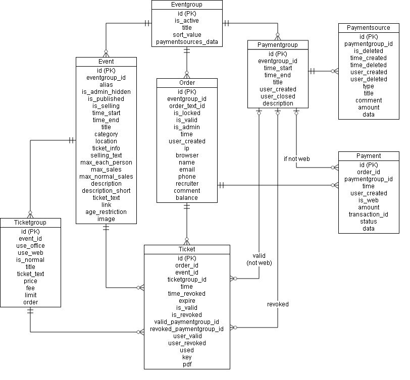

# UKA på Blindern sitt billettsystem

* [Om systemet](om.md)

## Data attributes/model

### Eventgroup
Grouping of events.
* int id
* bool is_active (allow modifications)
* string title
* string sort_value
* string paymentsources_data (JSON-data, see issue #87)

### Event
The events itself.
* int id
* int eventgroup_id (reference to event group)
* optional string alias (address used in url)
* bool is_admin_hidden (hide from default view in admin)
* bool is_published
* bool is_selling (is the event in sales mode?)
* datetime time_start
* optional datetime time_end
* string title
* optional string category
* optional string location
* optional string ticket_info (short text for tickets link)
* optional string selling_text (replaces default text if is_selling = 0, formatted with Markdown)
* int max_each_person (limit number of tickets for each person)
* int max_sales (limit of total tickets that can be sold)
* optional int max_normal_sales (limit of normal tickets that can be sold, admin can sell tickets not counting here)
* optional string description (description, formatted with Markdown)
* optional string description_short (description for meta tag)
* optional string ticket_text (plain text on the ticket itself)
* optional string link (link to related article)
* optional int age_restriction (lower age restriction)
* optional blob image (TODO: preferred size)

### Order
A reservation or actual order.
* int id
* int eventgroup_id
* string order_text_id (longer unique identificator)
* bool is_locked (lock if payments are being processed, disallow modifications to ticket collection by guestuser)
* bool is_valid (if the order has been processed successfully)
* bool is_admin (if the order is created by admin/ticket office, reservations of this will not expire)
* datetime time (when the order was created/completed)
* optional string user_created (user that created reservation/order)
* optional string ip (ip of the client)
* optional string browser (browser of the client)
* optional string name (name of the buyer)
* optional string email (email of the buyer)
* optional string phone (phonenumber of the buyer)
* optional string recruiter (name of person that recruited this order)
* optional string comment (admin comment)
* decimal(7,2) balance (difference between payments registered and ticket value, paid - ticketvalue)

### Paymentgroup
Payments that are not on web must belong to a Paymentgroup for accounting purposes.
* int id
* int eventgroup_id
* datetime time_start (the time the payment group was created)
* optional datetime time_end (the time the payment group was ended, if set refuse more payments)
* string title (a small description for the group)
* string user_created
* optional string user_closed
* optional string description

### Paymentsources
* id
* paymentgroup_id
* is_deleted (default = 0)
* time_created
* time_deleted
* user_created
* user_deleted
* type (enum: cash, other)
* title
* comment
* amount (start-amount is registered with minus)
* data (JSON for cash sales)

### Payments
Link between payment methods and orders.
* int id
* int order_id (reference to order)
* optional int paymentgroup_id (reference to payment group)
* datetime time (when the payment happened)
* optional string user_created (user that created payment)
* bool is_web (if the payment is by card on web page)
* decimal(7,2) amount (the amount paid, negative will mean a refund)
* optional string transaction_id (used by web payment)
* optional string status (used by web payment)
* optional string data (additional data if applicable in json)

### Ticketgroup
Ticket groups. All tickets belongs to a ticket group, which is also a price group.
* int id
* int event_id
* bool use_office (available to normal use on admin page, default is true)
* bool use_web (available for guests)
* bool is_normal (default = true) (should tickets with this group count in max_normal_sales for event?)
* string title (price group title)
* optional string ticket_text (additional plain text on the ticket)
* decimal(7,2) price
* optional decimal(7,2) fee (ticket fee)
* optional int limit (max number of tickets for this group, 0 = unlimited)
* int order (field to order ticketgroups by)

### Ticket
The tickets itself.
* int id
* int order_id (reference to order)
* int event_id (reference to event this ticket belongs)
* int ticketgroup_id (reference to ticket group)
* datetime time (when the ticket was created, and then when it was made valid)
* optional time_revoked (when the ticket was revoked)
* optional datetime expire (when the ticket will expire if not paid for, e.g. while creating order)
* bool is_valid (if the ticket is valid, e.g. paid for)
* bool is_revoked (if the ticket is revoked, e.g. refunded)
* optional int valid_paymentgroup_id (paymentgroup where it was made valid, if null => web)
* optional int revoked_paymentgroup_id (paymentgroup where it was revoked, if null => web)
* optional string user_valid (user that validated ticket)
* optional string user_revoked (user that revoked ticket)
* optional datetime used (when the ticket was registered used/checked in)
* optional string user_used (who marked the ticket as used)
* string key (the unique special number used to identify the ticket)
* optional blob pdf (the actual PDF for the ticket)
